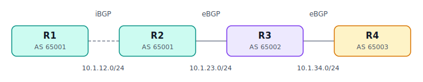

# BGP 协议详解与配置实例

BGP（Border Gateway Protocol，边界网关协议，当前版本 BGP-4）和前面两个最不一样。OSPF、IS-IS 都是**内部网关协议（IGP）**，目标是在一个自治系统内部算出最短路径；而 BGP 是**外部网关协议（EGP）**，是把全球数万个自治系统粘合成"互联网"的那个协议。它关注的不是"哪条路最短"，而是"按什么策略选路、把哪些路由通告给谁"。

## 一、BGP 的基本定位

理解 BGP 先记住三个转变：

它是**路径矢量（path-vector）**协议。通告路由时携带这条路由经过的完整 **AS 路径（AS_PATH）**，既用于防环，也用于选路。

它是**策略驱动**的，不是"最短优先"。选路要依次比较一长串**路径属性**，管理员可通过调这些属性把流量按商业意图引导，哪怕那条路并非物理最短。因为 AS 之间的互联本质上是商业关系（客户、对等、上游），选路要服从合同而非纯技术。

它跑在 **TCP 179 端口**上。邻居关系要先手工配置、建立 TCP 连接，再交换路由。第一次全量同步路由表，之后只发增量更新和 Keepalive。

## 二、核心概念

### 自治系统（AS）与 ASN

一个 AS 是由单一机构管理、对外执行统一路由策略的一组路由器，用 **AS 号（ASN）**标识。ASN 原为 16 位（1–65535），现已扩展到 32 位。其中 64512–65534（及 32 位段里的一段）是**私有 ASN**，仅供内部/实验使用——本文用的 65001 这类就是私有号。

### eBGP 与 iBGP

- **eBGP（外部 BGP）**：建立在**不同 AS** 的路由器之间，用来在 AS 之间交换路由。通常直连，报文 TTL 默认为 1。
- **iBGP（内部 BGP）**：建立在**同一 AS 内部**的路由器之间，把从外部学到的路由在 AS 内部传递。不要求直连，常跨越内部网络（靠 IGP 提供可达性）。

### 邻居状态机（FSM）

```
Idle → Connect → Active → OpenSent → OpenConfirm → Established
```

只有到 **Established** 才会交换路由。排错时卡在 **Active** 通常是 TCP 连不通（地址、ACL、可达性）；卡在 **Idle** 往往是邻居配置或对端没起。

### 报文类型

**Open**（建立时协商版本、AS 号、Hold 时间）、**Update**（通告或撤销路由，携带路径属性，核心）、**Keepalive**（保活）、**Notification**（出错时发送并断开）。

### 路径属性（BGP 选路的核心）

- **AS_PATH**：路由经过的 AS 序列。eBGP 每跨一个 AS 就把本 AS 号加到最前面。既防环（收到含自己 AS 号的路由就丢弃），也是选路项（越短越优）。
- **NEXT_HOP**：到达该路由的下一跳 IP。eBGP 通告时改成自己；iBGP 默认**不改**——这是 `next-hop-self` 要解决的坑。
- **LOCAL_PREF（本地优先级）**：只在 AS 内部（iBGP）传递，值越大越优，默认 100。
- **MED（多出口区分符）**：告诉邻居 AS"从哪个入口进来更好"，值越小越优。
- **ORIGIN**：路由来源（IGP < EGP < Incomplete，越靠前越优）。
- **WEIGHT（权重）**：思科私有、只在本路由器本地有效、不传递，值越大越优，优先级最高。
- **COMMUNITY（团体）**：给路由打的标签，用于成组地应用策略（详见 [07-BGP团体属性.md](07-BGP团体属性.md)）。

### 最佳路径选择顺序（思科，简化）

```
权重最高 → LOCAL_PREF 最高 → 本地始发 → AS_PATH 最短
→ ORIGIN 最优 → MED 最低 → eBGP 优于 iBGP
→ 到下一跳的 IGP 度量最低 → router-id 等决胜
```

实际工程中最常用来主动调整选路的是 **WEIGHT、LOCAL_PREF、AS_PATH、MED**。

### iBGP 水平分割与全互联

重要规则：**从一个 iBGP 邻居学到的路由，不会再通告给另一个 iBGP 邻居**（防环机制，因为 AS 内部传递时 AS_PATH 不变）。后果是一个 AS 内所有 iBGP 路由器必须两两建立邻接，形成**全互联（full mesh）**，会话数按 n(n-1)/2 增长。解决办法是**路由反射器（Route Reflector）**或**联盟（Confederation）**，详见 [06-路由反射器.md](06-路由反射器.md)。

## 三、配置实例（Cisco IOS）

拓扑：R1、R2 同属 **AS 65001**（之间跑 iBGP），R2 与 R3 之间是 **eBGP**（跨 AS 65001/65002），R3 与 R4 之间又是一段 **eBGP**（跨 AS 65002/65003）。



```
   [AS 65001]                    [AS 65002]      [AS 65003]

    R1 ------------- R2 ------------- R3 ------------- R4
        iBGP            eBGP            eBGP
     10.1.12.0/24    10.1.23.0/24    10.1.34.0/24
  宣告192.168.1.0/24              宣告192.168.2.0/24  宣告192.168.3.0/24
```

`router bgp <本AS号>` 启动进程，`neighbor <对端IP> remote-as <对端AS号>` 定义邻居——对端 AS 号和本机相同就是 iBGP，不同就是 eBGP。`network` 命令把指定前缀注入 BGP，**前提是这条前缀必须已存在于本机路由表**，否则不会被通告。

**R1（AS 65001，只跑 iBGP，宣告本地前缀）**

```
hostname R1
!
interface Loopback1
 ip address 192.168.1.1 255.255.255.0     ! 模拟本地网段
!
interface GigabitEthernet0/0
 ip address 10.1.12.1 255.255.255.0
!
router bgp 65001
 bgp router-id 1.1.1.1
 neighbor 10.1.12.2 remote-as 65001        ! iBGP 邻居 R2
 network 192.168.1.0 mask 255.255.255.0
```

**R2（AS 65001 边界路由器，对内 iBGP、对外 eBGP）**

```
hostname R2
!
interface GigabitEthernet0/0
 ip address 10.1.12.2 255.255.255.0
interface GigabitEthernet0/1
 ip address 10.1.23.2 255.255.255.0
!
router bgp 65001
 bgp router-id 2.2.2.2
 neighbor 10.1.12.1 remote-as 65001        ! iBGP 邻居 R1
 neighbor 10.1.12.1 next-hop-self          ! 关键，见下文
 neighbor 10.1.23.3 remote-as 65002        ! eBGP 邻居 R3
```

**R3（AS 65002，两侧都是 eBGP）**

```
hostname R3
!
interface Loopback1
 ip address 192.168.2.1 255.255.255.0
!
interface GigabitEthernet0/0
 ip address 10.1.23.3 255.255.255.0
interface GigabitEthernet0/1
 ip address 10.1.34.3 255.255.255.0
!
router bgp 65002
 bgp router-id 3.3.3.3
 neighbor 10.1.23.2 remote-as 65001        ! eBGP 邻居 R2
 neighbor 10.1.34.4 remote-as 65003        ! eBGP 邻居 R4
 network 192.168.2.0 mask 255.255.255.0
```

**R4（AS 65003）**

```
hostname R4
!
interface Loopback1
 ip address 192.168.3.1 255.255.255.0
!
interface GigabitEthernet0/0
 ip address 10.1.34.4 255.255.255.0
!
router bgp 65003
 bgp router-id 4.4.4.4
 neighbor 10.1.34.3 remote-as 65002        ! eBGP 邻居 R3
 network 192.168.3.0 mask 255.255.255.0
```

### 为什么 R2 上要配 `next-hop-self`（BGP 最经典的坑）

R2 从 R3 学到 192.168.2.0/24 时，下一跳是 R3 的 eBGP 接口 10.1.23.3。R2 通过 iBGP 传给 R1 时**默认不改下一跳**，于是 R1 收到的下一跳仍是 10.1.23.3。可 R1 不知道怎么到 10.1.23.3（AS 之间的链路，R1 路由表里没有），结果这条路由因下一跳不可达而无效。`next-hop-self` 让 R2 把通告给 iBGP 邻居的下一跳改成自己，R1 就能到了。生产里几乎所有 iBGP 边界路由器都要配它。

### 关于 iBGP 与 IGP 的配合

实际工程中 iBGP 通常**基于 Loopback 建立邻居**（更稳定），需要用 `neighbor x update-source Loopback0` 指定源地址，并且**底层先跑一个 IGP 让各路由器的 Loopback 互相可达**。这就是真实网络里 IGP 和 BGP 配合工作的标准方式——IGP 管 AS 内部可达性，BGP 管 AS 之间的策略路由。（详见 [04-IGP-BGP-结合.md](04-IGP-BGP-结合.md)）

## 四、常用验证命令

```
show ip bgp summary          # 看邻居及状态，Established 才正常
show ip bgp neighbors        # 看某邻居详细信息和协商参数
show ip bgp                  # 看 BGP 表，* 有效 > 最优 i 来自 iBGP
show ip route bgp            # 看进入路由表的 BGP 路由（标记 B）
show ip bgp 192.168.3.0      # 看某前缀的所有路径与属性
```

排查邻居不通：卡在 **Idle/Active** 多半是 TCP 层问题（地址错、不可达、ACL 挡 179、eBGP 跨多跳没配 `ebgp-multihop`）；邻居 Up 了但**收不到路由**，常见是对端没用 `network`/重分发注入、本端有入方向策略过滤、或下一跳不可达。

## 五、和 IGP 的本质区别

IGP 在**一个 AS 内**自动发现邻居、追求**最短路径**、收敛快、规模有限；BGP 在 **AS 之间**手工建立邻居、按**策略和路径属性**选路、为承载全球几十万条路由而设计、强调稳定与可控胜过收敛速度。一句话——IGP 解决"在我家内部怎么走最快"，BGP 解决"我和其他人家之间，按什么规矩互通有无"。

---

[← 上一篇：IS-IS 协议](02-ISIS.md) · [返回目录](README.md) · [下一篇：IGP 与 BGP 结合实例 →](04-IGP-BGP-结合.md)
