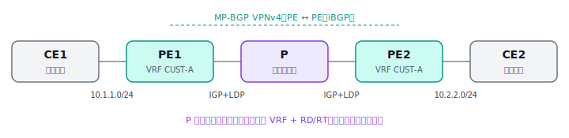

# MPLS L3VPN

MPLS L3VPN 是运营商用一张共享骨干网，同时为大量客户承载各自私有 IP 路由、且彼此严格隔离的经典方案。它是前面 BGP、IGP、团体属性几篇知识的综合应用，也是"为什么要学这些"的最好答案之一。

## 一、要解决的问题

一个运营商要同时服务成百上千家企业客户，每家都有自己的内网，而且**地址还可能重叠**（大家都在用 10.0.0.0/8、192.168.0.0/16）。运营商既要用一张骨干网把每家客户的多个站点连起来，又要保证 A 公司绝对看不到 B 公司的路由。MPLS L3VPN 就是干这个的。

## 二、三类角色



```
 [客户A 站点1]            服务商骨干（MPLS）            [客户A 站点2]

   CE1 ------ PE1 =========== P =========== PE2 ------ CE2
            (VRF CUST-A)   (纯标签转发)    (VRF CUST-A)
  10.1.1.0/24                                        10.2.2.0/24

            <------ MP-BGP VPNv4：PE 之间 iBGP ------>
            <------------ 核心 IGP + LDP 标签 ------->
```

- **CE（Customer Edge，客户边缘）**：客户自己的路由器，跟运营商之间跑一个普通路由协议，对 MPLS 完全无感知。
- **PE（Provider Edge，运营商边缘）**：运营商的边缘路由器，是整套方案的核心——它持有各客户的 VRF、运行 MP-BGP、负责打/解 VPN 标签。
- **P（Provider，骨干核心）**：只做标签转发，**不保存任何客户路由**，只认外层标签把包送到对端 PE。

## 三、四个关键概念

**① VRF（VPN 路由转发表）。** 在 PE 上为每个客户建一张独立的路由表，把朝向该客户 CE 的接口绑进对应 VRF。客户之间的路由因此天然隔离——这是"逻辑上把一台 PE 切成多台虚拟路由器"。

**② RD（Route Distinguisher，路由区分符）。** 8 字节，拼在客户的 IPv4 前缀前面，构成 12 字节的 **VPNv4 前缀**。这样即便两家客户都用 10.1.1.0/24，加上不同 RD 后在骨干里也全局唯一，解决了地址重叠问题。RD 按 VRF 配置。

**③ RT（Route Target，路由目标）。** 一种**扩展团体属性**，控制 VPNv4 路由在哪些 VRF 之间导入导出。PE 通告路由时附上 export RT，接收端 PE 按 VRF 配置的 import RT 决定收不收。通过设计 RT，可以做出全互联、Hub-Spoke 等各种 VPN 拓扑。

**④ MP-BGP（VPNv4 地址族）。** PE 之间用 MP-BGP（多协议 BGP）的 VPNv4 地址族交换带 RD/RT 的客户路由，通常是 iBGP，规模大时配[路由反射器](06-路由反射器.md)。

## 四、两层标签

数据包在骨干里转发时压**两层标签**：

- **外层（传输标签）**：由核心 IGP + LDP 分发，作用是把包从入口 PE 沿着 P 路由器送到出口 PE（对应出口 PE 的 Loopback）。P 路由器只看这一层。
- **内层（VPN 标签）**：由出口 PE 分配，告诉它"这个包属于哪个 VRF、该交给哪个 CE"。P 路由器不碰它。

控制平面流程：CE 把路由通过 PE-CE 协议给入口 PE → PE 放进 VRF、加上 RD 和 export RT 变成 VPNv4 路由 → 经 MP-BGP 发给出口 PE → 出口 PE 按 import RT 匹配收进对应 VRF → 再通过 PE-CE 协议给 CE。

## 五、配置实例（Cisco IOS，以 PE1 为例）

```
! ---- 1) 定义 VRF，配 RD 和 RT ----
ip vrf CUST-A
 rd 65000:100
 route-target export 65000:100
 route-target import 65000:100
!
! ---- 2) 把朝 CE 的接口绑进 VRF ----
interface GigabitEthernet0/1
 ip vrf forwarding CUST-A
 ip address 10.1.1.1 255.255.255.0
!
! ---- 3) 核心侧：IGP 可达 + 启用 MPLS/LDP ----
interface GigabitEthernet0/0
 ip address 10.0.0.1 255.255.255.0
 mpls ip                                   ! 在核心接口启用 MPLS 标签转发
!
interface Loopback0
 ip address 1.1.1.1 255.255.255.255        ! PE 的 BGP/LDP 标识，必须 IGP 可达
!
router ospf 1                              ! 核心 IGP，承载 PE/P 的 Loopback 互通
 network 10.0.0.0 0.0.0.255 area 0
 network 1.1.1.1 0.0.0.0 area 0
!
! ---- 4) MP-BGP：与对端 PE 交换 VPNv4 ----
router bgp 65000
 neighbor 2.2.2.2 remote-as 65000          ! 对端 PE2 的 Loopback
 neighbor 2.2.2.2 update-source Loopback0
 !
 address-family vpnv4
  neighbor 2.2.2.2 activate
  neighbor 2.2.2.2 send-community extended  ! RT 是扩展团体，必须开启发送
 exit-address-family
 !
 ! ---- 5) PE-CE：在 VRF 地址族里和 CE 建邻居（此处用 eBGP）----
 address-family ipv4 vrf CUST-A
  neighbor 10.1.1.2 remote-as 65100         ! CE1 的 AS
  neighbor 10.1.1.2 activate
 exit-address-family
```

PE2 配置对称：同样的 `ip vrf CUST-A`（RD 可不同、但 RT 必须能对上）、绑接口、MP-BGP 邻居指回 PE1、VRF 内和 CE2 建 PE-CE 邻居。P 路由器最简单——只要跑核心 IGP、在所有核心接口 `mpls ip` 起 LDP 即可，**不需要任何 VRF 或 BGP 配置**。

PE-CE 也可以用 OSPF、静态路由等，那种情况下要在 `address-family ipv4 vrf` 里用 `redistribute` 把客户路由引入 MP-BGP。新版 IOS 用 `vrf definition` + `address-family ipv4` 的写法替代老的 `ip vrf`。

## 六、验证命令

```
show ip vrf                          # 看已建的 VRF 及绑定接口
show ip route vrf CUST-A             # 看某客户 VRF 的路由表
show bgp vpnv4 unicast all           # 看所有 VPNv4 路由（含 RD/RT/标签）
show mpls ldp neighbor               # 看 LDP 邻居（核心标签分发）
show mpls forwarding-table           # 看标签转发表（外层标签）
```

排错顺序同样自底向上：先确认核心 IGP 通、PE 的 Loopback 互相可达；再确认 LDP 邻居起来、有标签；然后看 MP-BGP VPNv4 邻居是否 Established、`send-community extended` 是否漏配（漏了 RT 传不过去，对端收不到路由）；最后核对两端 RT 的 import/export 是否匹配。

---

[← 上一篇：BGP 团体属性](07-BGP团体属性.md) · [返回目录](README.md) · [下一篇：BGP 选路实验 →](09-BGP选路实验.md)
