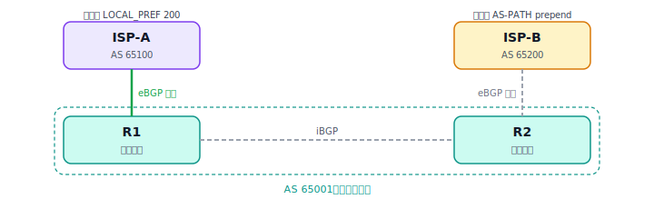

# BGP 选路实验：主备出口

本文是一个动手实验，用 **LOCAL_PREF** 和 **AS-PATH prepend** 两个最常用的手段，把一个双归（dual-homed）网络的流量调成"一条主、一条备"。它把 [03-BGP.md](03-BGP.md) 里讲的路径属性和选路顺序落到具体配置上。

## 一、实验目标

一个企业 AS 65001 同时接了两家运营商，要求：正常情况下进出流量都走 R1–ISP-A 这条主链路，只有它故障时才切到 R2–ISP-B。需要分别控制**两个方向**：

- **出方向**（我方发往外网）：用 **LOCAL_PREF** 让本 AS 内部都优先从 R1 出去。
- **入方向**（外网回到我方）：用 **AS-PATH prepend** 让别人觉得走 R2 那条路"更长"，从而优先从 R1 进来。

## 二、拓扑



```
        ISP-A (AS 65100)              ISP-B (AS 65200)
             |                              |
            eBGP                           eBGP
             |                              |
            R1 ============ iBGP ========== R2          [AS 65001]
             \                              /
              \------ 内网 / 业务网段 ------/
                     203.0.113.0/24（对外宣告）
```

R1、R2 之间跑 iBGP（基于 Loopback，底层有 IGP，参见 [04-IGP-BGP-结合.md](04-IGP-BGP-结合.md)）。两家 ISP 都能到达外部目标，我方也把自己的 203.0.113.0/24 同时通告给两家。

## 三、出方向：用 LOCAL_PREF 选主出口

LOCAL_PREF 在**整个 AS 内部**（iBGP）传递、值大者优，且在选路顺序里排得非常靠前（仅次于思科私有的 WEIGHT）。所以只要在 R1 上把从 ISP-A 收到的路由本地优先级抬高，全 AS 的内部路由器都会一致地选择从 R1 出去。

**R1（入站方向抬高 LOCAL_PREF）**

```
route-map FROM-ISPA permit 10
 set local-preference 200          ! 默认是 100，这里抬到 200
!
router bgp 65001
 neighbor <ISP-A-IP> remote-as 65100
 neighbor <ISP-A-IP> route-map FROM-ISPA in
```

R2 那边对从 ISP-B 收到的路由不做处理，保持默认 LOCAL_PREF 100。于是同一目的地，R1 学到的（200）优于 R2 学到的（100），内部所有路由器出方向都走 R1。R1 故障后这些路由消失，自动回退到 R2 的 100，实现备份。

## 四、入方向：用 AS-PATH prepend 引导回程

入方向不在你掌控之内——是**外部 AS** 决定怎么回到你。你能做的是让自己经 R2 通告出去的路由"显得不优"。最通用的办法是 **AS-PATH prepend**：在通告时把自己的 AS 号重复几遍，人为拉长 AS_PATH，外部 AS 在比较时（AS_PATH 越短越优）就会偏向另一条。

**R2（出站方向给自己的前缀做 prepend）**

```
ip prefix-list MYNET permit 203.0.113.0/24
!
route-map TO-ISPB permit 10
 match ip address prefix-list MYNET
 set as-path prepend 65001 65001 65001    ! 额外多垫 3 个自己的 AS 号
route-map TO-ISPB permit 20                ! 放行其余
!
router bgp 65001
 neighbor <ISP-B-IP> remote-as 65200
 neighbor <ISP-B-IP> route-map TO-ISPB out
```

这样外部看 203.0.113.0/24：经 ISP-A（R1）的 AS_PATH 是 `65001`，经 ISP-B（R2）的是 `65001 65001 65001 65001`，明显更长，于是优先从 ISP-A → R1 回来。R1 链路断了，prepend 过的 R2 路径仍然可用，自动接管。

## 五、验证

```
show ip bgp 203.0.113.0            # 看本地及对外宣告的路径与 AS_PATH
show ip bgp                        # 出方向看 LOCAL_PREF 列，确认 R1 学到的是 200
show ip bgp neighbors <IP> advertised-routes   # 看 R2 发给 ISP-B 的前缀 AS_PATH 是否已 prepend
show ip route                      # 确认实际选中的出口下一跳指向 R1
```

预期：出方向最优路径的 LOCAL_PREF 为 200、下一跳指向 R1；R2 向 ISP-B 通告的 203.0.113.0/24 带有加长后的 AS_PATH。把 R1 的链路 shutdown，再看流量是否平滑切到 R2。

## 六、注意事项

**① LOCAL_PREF 只在你自己 AS 内有效**，控制的是"出方向"；它不会传给别人，影响不了别人怎么选你。

**② AS-PATH prepend 只是"建议"，不是命令。** 它影响入方向，但外部 AS 如果用 LOCAL_PREF 等更高优先级的策略硬选了走 ISP-B，你的 prepend 就被无视——因为别人的 LOCAL_PREF 在他们的选路顺序里排在 AS_PATH 之前。入方向工程通常要和上游沟通，或配合 **MED**（同一个上游 AS 的两条链路之间用 MED 区分，越小越优）和 **BGP 团体**（很多运营商提供团体值让你远程影响他们的 LOCAL_PREF）。

**③ 只想影响某一台路由器自己的出方向**，可以用思科私有的 **WEIGHT**（本地有效、不传递、优先级最高）：

```
neighbor <ISP-A-IP> weight 200
```

WEIGHT 与 LOCAL_PREF 的区别：WEIGHT 只对配置它的那一台路由器生效，LOCAL_PREF 影响整个 AS。

---

[← 上一篇：MPLS L3VPN](08-MPLS-L3VPN.md) · [返回目录](README.md) · [下一篇：MPLS L3VPN 进阶 →](10-MPLS-HubSpoke-Extranet.md)
