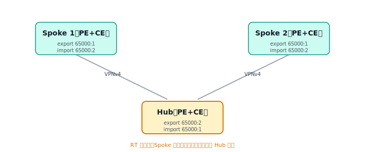

# MPLS L3VPN 进阶：Hub-Spoke 与 Extranet 的 RT 设计

[08-MPLS-L3VPN.md](08-MPLS-L3VPN.md) 里的基础 VPN 用的是"对称 RT"——所有站点 export/import 同一个 RT，于是任意站点都能互通，即 **any-to-any（全互联）**。但很多真实需求并不是全互联，而要靠精心设计的 **RT** 来塑造 VPN 的拓扑。本文讲两个最常见的：Hub-Spoke 和 Extranet。

> 先记住一句话：**RT 决定一条 VPNv4 路由会被哪些 VRF 导入。"谁能看见谁的路由"，就等于"谁能访问谁"。** Hub-Spoke 和 Extranet 都是在这句话上做文章。

## 一、Hub-Spoke：强制流量经中心节点

### 需求

分支机构（Spoke）之间不允许直接通信，所有跨分支流量必须先回到总部（Hub），在那里过防火墙、做集中安全检查或访问集中部署的服务，再转发到目标分支。



### RT 非对称设计

定义两个 RT：`RT_SPOKE = 65000:1`（Spoke 导出用）、`RT_HUB = 65000:2`（Hub 导出用）。关键在于让导入导出**不对称**：

| 角色 | export RT | import RT |
|---|---|---|
| Spoke 的 VRF | 65000:1 | 65000:2 |
| Hub 的 VRF | 65000:2 | 65000:1 |

推演一下就明白了：Spoke 导出的路由带 `65000:1`，只有 Hub（import 65000:1）会收，**别的 Spoke 不收**——所以 Spoke 之间互相看不见，无法直连。Hub 导出的路由带 `65000:2`，所有 Spoke（import 65000:2）都收——所以每个 Spoke 都知道怎么回到 Hub。结果就是流量被强制汇聚到 Hub。

### 一个关键细节：Hub 必须能"回传"

只做上面的 RT 还不够。Spoke1 的路由进了 Hub，但 Hub 默认不会把它再发给 Spoke2（否则就违背隔离了）。要让 Spoke1↔Spoke2 经 Hub 互通，常见做法是 **Hub 站点向所有 Spoke 下发一条默认路由（或汇总路由），并由 Hub 把收到的 Spoke 路由经自己的 CE 再注入回来**。工程上典型实现是 Hub-PE 上用**两个 VRF / 两个逻辑接口**（一个朝 Hub-CE 收 Spoke 明细、一个朝 Hub-CE 发默认路由），让流量在 Hub-CE 上"绕一圈"再出去。配置较繁，核心思想就是：靠 RT 把"看见"限制成单向汇聚，再靠 Hub 的回传补上中转能力。

### 配置片段（RT 部分）

```
! Spoke-PE 的 VRF
ip vrf SPOKE
 rd 65000:11
 route-target export 65000:1
 route-target import 65000:2
!
! Hub-PE 的 VRF
ip vrf HUB
 rd 65000:21
 route-target export 65000:2
 route-target import 65000:1
```

## 二、Extranet：两个 VPN 之间的受控互访

### 需求

正常情况下 VPN-A 和 VPN-B 是两家不同客户、完全隔离。但有时需要**有限度地互访**——比如它们要共同访问一台放在 VPN-S 里的共享服务器，或者 A、B 因业务合作要互通某几个网段。这种"跨 VPN 的选择性互通"就叫 Extranet。

### 思路：交叉导入对方的 RT

Extranet 的本质是让一个 VRF **额外导入**另一个 VPN 导出的 RT。但要小心：如果无脑导入对方全部 RT，就等于把两个 VPN 合并了。所以实践中通常配合 **import map（按前缀过滤导入）**，只放进需要共享的那几条路由。

```
! VPN-A 想访问 VPN-B 导出的共享网段（B 用 RT 65000:200 标记共享路由）
ip vrf VPN-A
 rd 65000:100
 route-target export 65000:100
 route-target import 65000:100
 route-target import 65000:200          ! 额外导入 B 的共享 RT
 import map ONLY-SHARED                 ! 只放行需要的前缀，避免全量泄漏
!
ip prefix-list SHARED permit 10.99.0.0/24
route-map ONLY-SHARED permit 10
 match ip address prefix-list SHARED
```

B 侧同理，给要共享的路由打上 `65000:200`、并按需导入 A 的 RT。通过这种"交叉导入 + 过滤"，就能精确控制"A 的哪些网段能看到 B 的哪些网段"。

### 注意：地址不能重叠

Extranet 互访的前提是两个 VPN 在要互通的部分**地址不重叠**。VPN 之间地址重叠靠 RD 在骨干里区分没问题，但一旦要把对方路由导进自己 VRF 做实际转发，重叠地址就会冲突——这时需要 NAT 等额外手段，超出 RT 设计的范畴。

## 三、小结

Hub-Spoke 和 Extranet 都说明了同一件事：**MPLS L3VPN 的拓扑不是靠物理连接决定的，而是靠 RT 的导入导出策略"画"出来的。** 对称 RT 得到全互联，非对称 RT 得到汇聚型 Hub-Spoke，交叉导入特定 RT 得到选择性 Extranet。掌握"RT 控制可见性"这条主线，各种 VPN 拓扑都能推导出来。

---

[← 上一篇：BGP 选路实验](09-BGP选路实验.md) · [返回目录](README.md) · [下一篇：BGP 的 BFD 快速故障检测 →](11-BGP-BFD.md)
