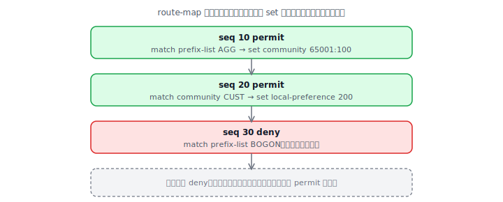

# prefix-list 与 route-map 综合实战

prefix-list 和 route-map 是路由策略的两大基础工具，几乎所有路由控制（过滤、重分发、BGP 选路、PBR）都建立在它们之上。本文先分别讲清楚，再用一个综合例子把它们组合起来。

## 一、prefix-list：高效精确的前缀匹配

prefix-list 用来匹配一组 IP 前缀，比传统 ACL 更直观、更高效，还能用 `ge`/`le` 精确控制掩码长度范围。

```
ip prefix-list NAME [seq N] permit|deny  A.B.C.D/len  [ge X] [le Y]
```

- 不带 `ge`/`le`：**精确匹配**该前缀（网络号和掩码长度都要一致）。
- `ge X`：匹配掩码长度 ≥ X 的更具体路由。
- `le Y`：匹配掩码长度 ≤ Y 的路由。
- 自上而下匹配，命中即停，**末尾有隐式 deny**。

几个常用写法：

```
! 只匹配这一条精确路由
ip prefix-list P1 permit 10.1.1.0/24

! 匹配 10.0.0.0/8 下、掩码 24~32 的所有更具体路由
ip prefix-list P2 permit 10.0.0.0/8 ge 24 le 32

! 只匹配默认路由
ip prefix-list DEFAULT permit 0.0.0.0/0

! 匹配任意前缀的任意掩码（相当于 permit any）
ip prefix-list ANY permit 0.0.0.0/0 ge 0 le 32
```

理解 `ge`/`le` 的关键：它们约束的是**掩码长度**，且必须满足 `len < ge ≤ le ≤ 32`。比如 `10.0.0.0/8 ge 24 le 24` 只匹配 10 段里的 /24，不多不少。

## 二、route-map：带条件的策略引擎

route-map 是一串有序的子句（clause），每条子句有一个 `permit`/`deny` 动作，子句里用 `match` 设条件、用 `set` 改属性。

```
route-map NAME permit 10        ! 序号 10 的 permit 子句
 match ...                      ! 条件（可多个，逻辑 AND）
 set ...                        ! 动作（修改属性）
```

执行规则：自上而下逐条匹配，**命中某条 permit 就执行其 set 然后停止**；命中 deny 则丢弃该路由；全部不命中则被**末尾隐式 deny**丢弃。



`permit` 与 `deny` 的含义要分清：在路由过滤场景里，`permit` 子句放行（并可改属性）匹配到的路由，`deny` 子句丢弃匹配到的路由。**最容易踩的坑**就是只写了几条 permit，忘了未匹配的路由会被隐式 deny 全部丢掉——所以常在末尾补一条空的 `route-map NAME permit 99` 放行其余。

## 三、综合实战：一个 BGP 出方向策略

目标：在向某 eBGP 邻居通告路由时，做到 ——给自己的汇总路由打团体标签、对一批客户路由抬升优先并加 AS-PATH、过滤掉非法 bogon 前缀、放行其余。把 prefix-list、community-list、route-map 全用上：

```
! ---- 1) 用 prefix-list 定义各类前缀 ----
ip prefix-list AGG   permit 203.0.113.0/24
ip prefix-list CUST  permit 198.51.100.0/22 ge 24 le 24
ip prefix-list BOGON permit 10.0.0.0/8 le 32
ip prefix-list BOGON permit 192.168.0.0/16 le 32
!
! ---- 2) route-map 分子句处理 ----
route-map OUT-POLICY deny 5
 match ip address prefix-list BOGON          ! 先把私网/非法前缀挡掉
!
route-map OUT-POLICY permit 10
 match ip address prefix-list AGG
 set community 65001:100                       ! 自己的汇总打标签
!
route-map OUT-POLICY permit 20
 match ip address prefix-list CUST
 set as-path prepend 65001                     ! 客户路由做一次 prepend
!
route-map OUT-POLICY permit 99                 ! 放行其余（否则被隐式 deny）
!
! ---- 3) 应用到 BGP 邻居 ----
router bgp 65001
 neighbor 192.0.2.2 remote-as 65002
 neighbor 192.0.2.2 send-community              ! 打了 community 就要开
 neighbor 192.0.2.2 route-map OUT-POLICY out
```

逐条读这个 route-map：序号 5 是 deny，bogon 前缀直接被丢；序号 10 给汇总路由 203.0.113.0/24 打上团体 65001:100；序号 20 给客户网段做 AS-PATH prepend；序号 99 是一条没有 match 的 permit，作用是"放行所有前面没处理到的路由"。顺序很重要——deny 放最前面先做清洗，最后用一条 permit 兜底。

## 四、验证与排错

```
show ip prefix-list NAME             # 看 prefix-list 条目与命中计数
show route-map OUT-POLICY            # 看 route-map 各子句及命中次数
show ip bgp neighbors 192.0.2.2 advertised-routes   # 看实际通告出去的路由
```

排错三连：① route-map 是不是漏了末尾的 permit，导致想放行的路由被隐式 deny；② prefix-list 的 `ge`/`le` 范围是否写对（最常见是漏了 `ge`/`le` 导致只精确匹配、放过了更具体路由）；③ 打了 community 却没配 `send-community`。这几样配合 [团体属性](07-BGP团体属性.md) 和 [选路实验](09-BGP选路实验.md) 一起看，就能覆盖绝大多数日常路由策略需求。

---

[← 上一篇：BGP 的 BFD 快速故障检测](11-BGP-BFD.md) · [返回目录](README.md)
